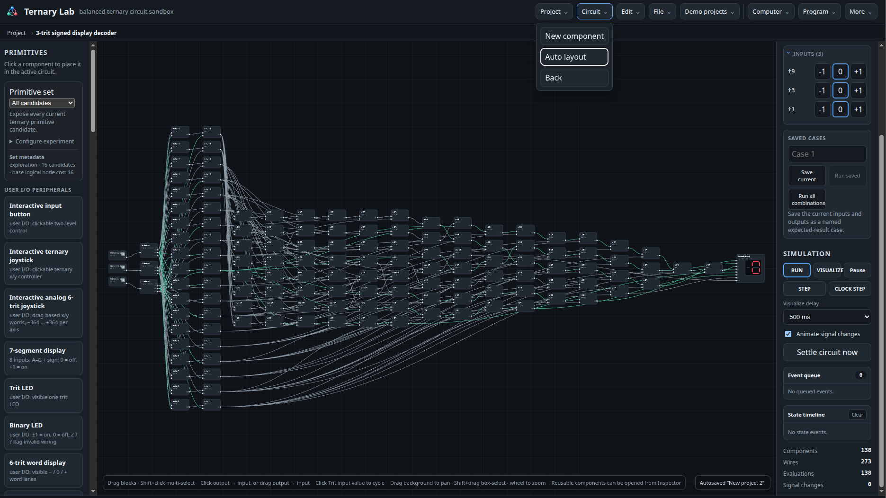

# Tutorial 1 – Your first circuit

The goal is a minimal visible circuit: an **Interactive trit input** driving a **Trit LED**. It teaches placement, wiring, and the meaning of ternary signal values.

## 1. Start an empty project

Choose **Project → New project**. You can also start from a demo, but an empty workspace makes this circuit easier to see.

## 2. Place an input and an output

In the component list, place:

1. **Interactive trit input**.
2. **Trit LED**.

Move them apart slightly so there is space for a wire between the components.

## 3. Connect them

Click the trit input's output, then click the LED input. You can also drag from the output to the input. A wire appears when the connection is valid.

Click the trit input's value badge to cycle through `-1`, `0`, and `+1`. The LED should show the same trit value.

## 4. Read the signal correctly

- `-1`, `0`, and `+1` are the three ordinary logic levels.
- `Z` means a pass switch no longer drives the wire.
- `?` means the simulator cannot determine a stable value, for example because logic is incomplete or invalid.

An LED is an observer: it displays a signal but never drives anything back into the circuit.

## Next experiment

Place a **Negate** between the input and LED. Then `-1` becomes `+1`, `+1` becomes `-1`, and `0` remains `0`. Add a second LED before the negator to view both values at once.

When you want to turn this circuit into your own block, continue to [Tutorial 2](02-reusable-component.md).

