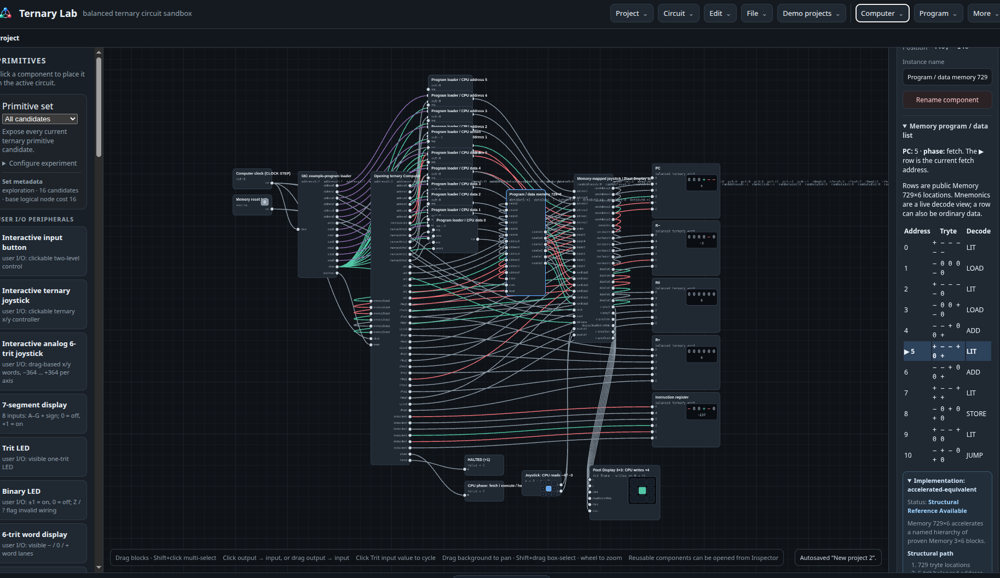

# Tutorial 3 – Run and debug a program

The CPU demos are small but complete computers. Program memory holds trytes, and the program counter normally begins at address `0` unless a program says otherwise.

## 1. Open a computer

Choose a CPU demo under **Demo projects**, such as the small inspectable computer or the larger-memory version. Then choose **Program → Load example** to fill memory without necessarily starting execution.

## 2. Read the program

Select **Program / data memory**. Inspector shows memory rows with an address, a tryte, and a decoded instruction when the row contains an instruction. The highlighted or current program-counter address shows where the CPU is.

Memory can also contain ordinary data. A mnemonic in the list is therefore a decoding aid for instruction-shaped trytes, not a guarantee that every row is executable code.

## 3. Step instead of running freely

Use **Computer → Instruction step** to run one whole instruction. After every step, inspect:

- the program counter (PC),
- the instruction register,
- register values,
- memory access and I/O.

**Computer → Run computer** is better once you know the program should keep running without stopping. Reset or load the example again when you want to start from the first instruction.

## 4. Write and share programs

Open **Program → Write program** to write a short program in the editor. You can validate and load it into memory before execution starts. Use **Import program** and **Export program** to share a program with someone else.

The instruction format, mnemonics, and current opcode table are in [ISA.md](../ISA.md).

Continue to [Tutorial 4](04-debugging.md) when a program does not behave as expected.
